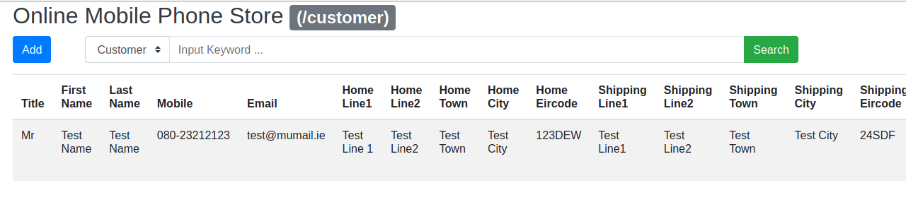

# Some Coding Practice

## Automated Testing
Black box testing with Python and Pytest framework.

## Data Structure & Algorithm
Some code snippets about data structure, like stack, queue, sorting, linked list, recursion 
- lab1 Luhn algorithm
- lab2 Block stacking problem
- lab3 Primes in a range
- lab4 MonteCarlo
- lab5 Strings sorting
- lab6 Palindrome check
- lab7 Middle number
- lab8 Partition problem
- lab9 Long division
- lab10 Dice probability
- lab11 Circular prime
- lab12 Review

## Front-end
- Food pyramid (HTML/CSS/JavaScript)

    
- Simon memory game (HTML/CSS/JavaScript)

    
- Student grades table (HTML/CSS/JavaScript)

    
- Working with MySQL (Node.js/MySQL)
- Working with NoSQL (Node.js/MongoDB)

    
- Online mobile phone store RESTful API (Node.js/MongoDB/Express/RESTful API)

    
- Online mobile phone store SPA (Node.js/MongoDB/Express/Handlebars)

    
- Client relationship managemen app (Node.js/MongoDB/Express/Handlebars)

## Java
- Realtime train schedule display (Bootstrap/Servlet/Jsoup)

    
- XML Soap server (XML/Soap)

    
- Threadpool managed socket session (Socket)

    

    

